# Smart Employee & Project Management System

The **Smart Employee & Project Management System** is a full-stack enterprise web application built using **React 18** (frontend) and **Spring Boot 3.3.2** (backend) with **MySQL 8.4** database persistence. It was developed by **Gundlapalli Venkata Sai Badhrinadh** to demonstrate modern enterprise software engineering practices, role-based security, project/task tracking, real-time analytics, reporting, user profile management, database management, and asynchronous email notifications.

---

## 1. Tech Stack Overview

| Layer | Technology / Library | Description |
| :--- | :--- | :--- |
| **Frontend Framework** | React 18, Vite 5 | Single Page Application framework and build tool |
| **Frontend UI & Styling** | Material UI (MUI v5), Emotion | Design system components, dark/light theme support |
| **Data Export & Visualization**| Recharts, jsPDF, jsPDF-AutoTable, Custom CSV | Analytics charts, dual CSV (Excel-compatible) & PDF exports |
| **HTTP Client & Routing** | Axios, React Router v6 | API request handling with JWT interceptors & route protection |
| **Backend Framework** | Java 17, Spring Boot 3.3.2 | Core backend framework and REST API engine |
| **Security & Auth** | Spring Security, JJWT (0.12.6) | Stateless JWT authentication & Role-Based Access Control |
| **Persistence & ORM** | Spring Data JPA, Hibernate | Database access layer with automated schema management |
| **Database** | MySQL 8.4 / 8.0 | Relational database engine |
| **Testing & Quality** | JUnit 5, Mockito, Spring Boot Test | Backend unit and integration test suite |
| **Mail & Notifications** | Spring Boot Mail, `@EnableAsync` | Asynchronous HTML email alert dispatches |
| **API Documentation** | Springdoc OpenAPI (Swagger UI v2.6.0) | Interactive API documentation |
| **Containerization** | Docker, Docker Compose | Multi-container environment (MySQL, Spring Backend, Nginx Frontend) |
| **Build & Package** | Maven 3.8+, npm | Dependency management and build tools |

---

## 2. Application Screenshots & Feature Walkthrough

This section presents visual highlights of the application's operational portals, security flows, management interfaces, and reporting modules.

---

### 2.1 Authentication, Registration & Access Security

Stateless JWT authentication portal supporting light/dark theme toggling, client-side regex input validation, and an admin approval gate for new user registrations.

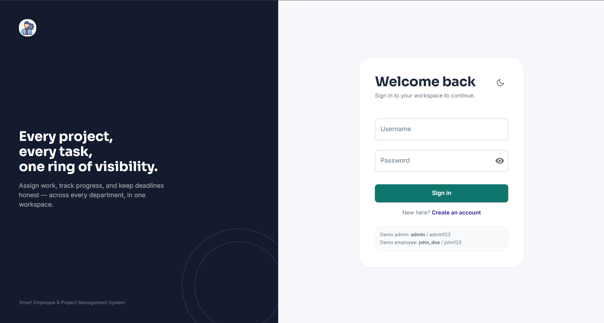
*Figure 2.1: JWT Authentication & User Login Portal.*

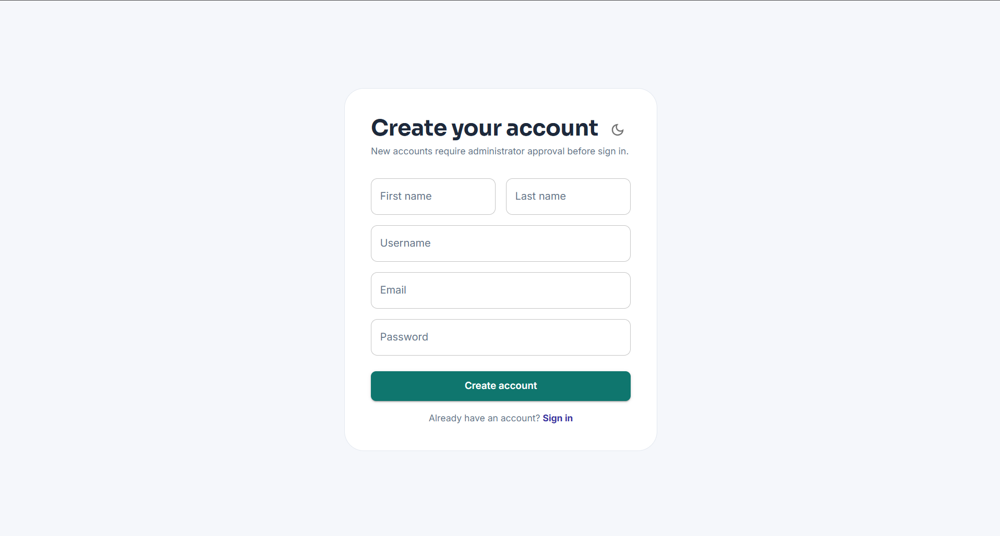
*Figure 2.2: Employee Registration Interface with real-time regex validation.*

---

### 2.2 System Admin Command Center (`ROLE_ADMIN`)

Administrative control hub providing complete oversight for employee lifecycle management, project tracking, task allocation, analytics, and operational report exports.

#### 2.2.1 Admin Dashboard & Live Analytics
Central dashboard with real-time KPI counter cards, interactive analytics charts, and a manual test email dispatch trigger.

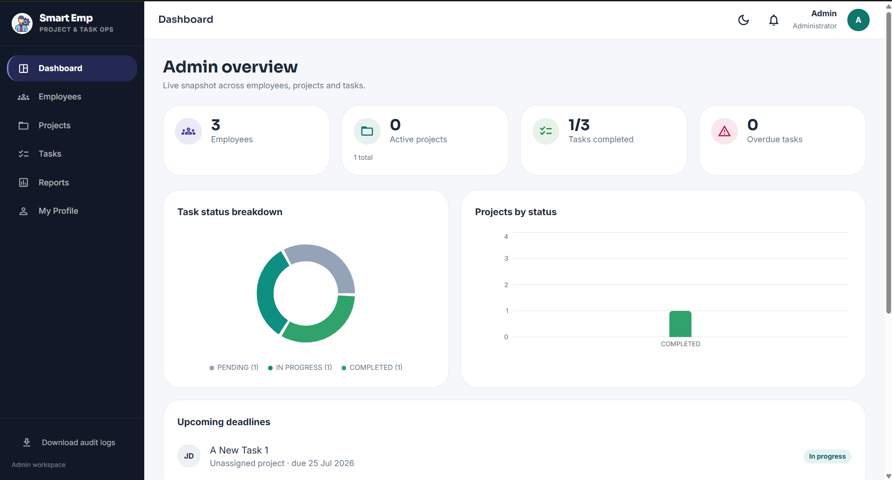
*Figure 2.3: System Admin Dashboard featuring live KPI counters and analytics charts.*

#### 2.2.2 Employee Management & Approval Queue
Employee management table featuring search filters, date range filters (hire date), multi-field sorting, server-side pagination, role indicators, and one-click account approvals.

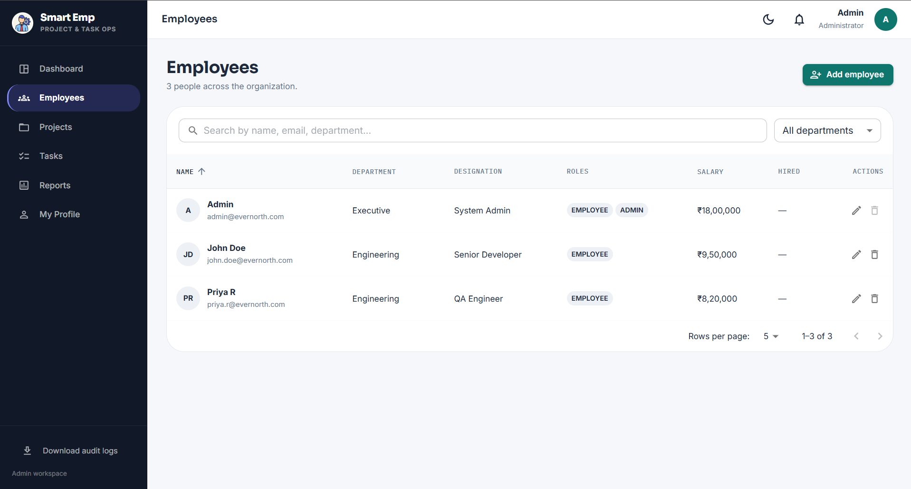
*Figure 2.4: Employee Management table with search, date filters, sorting, and approval actions.*

#### 2.2.3 Project Lifecycle Management
Project grid with Many-to-Many employee team assignments, status/priority indicators, start/end date range filtering, and dynamic task completion progress indicators.

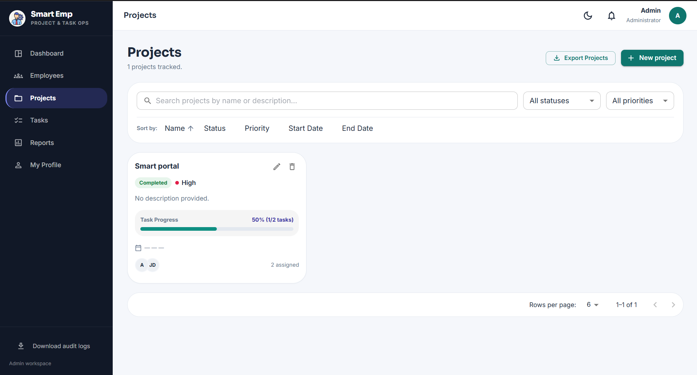
*Figure 2.5: Project Management interface displaying project cards and dynamic task progress.*

#### 2.2.4 Task Tracking & Assignment
Comprehensive task allocation view supporting individual employee assignments, priority badges, deadline date range filtering, remarks, and inline status updates.

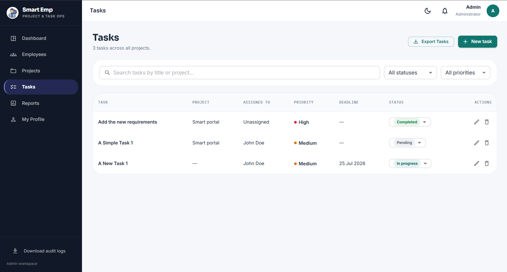
*Figure 2.6: Task Management view with instant search, deadline filtering, and status controls.*

#### 2.2.5 Reports & Dual Format Export (CSV / PDF)
Aggregated reporting module across Employee-wise Tasks, Project Progress, and Pending Tasks tabs with one-click export to Excel-compatible CSV files or formatted PDF documents.

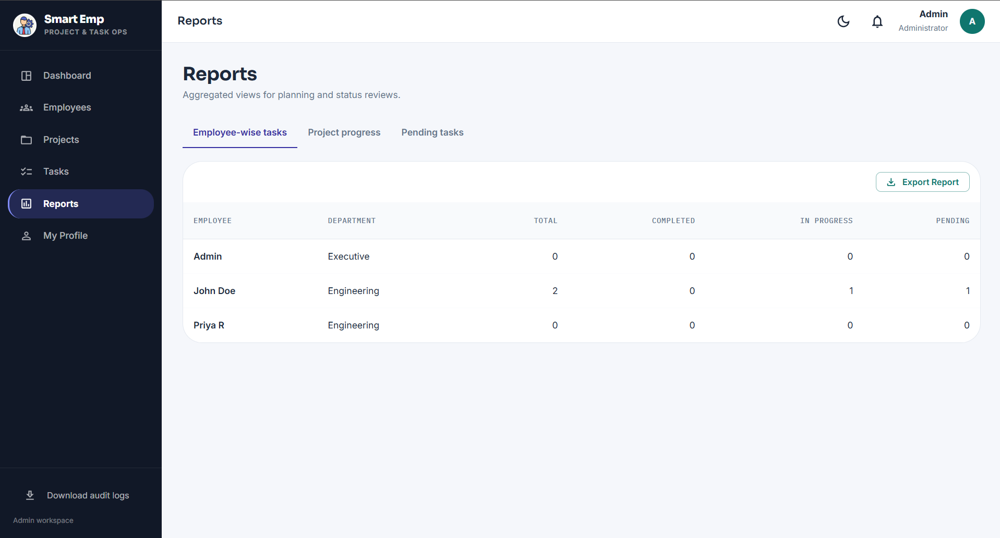
*Figure 2.7: Aggregated Operational Reports module with CSV and PDF export options.*

#### 2.2.6 User Profile Management & Work Stats
User profile interface featuring account credentials, department metadata, work performance metrics, and an edit profile dialog with password updates.

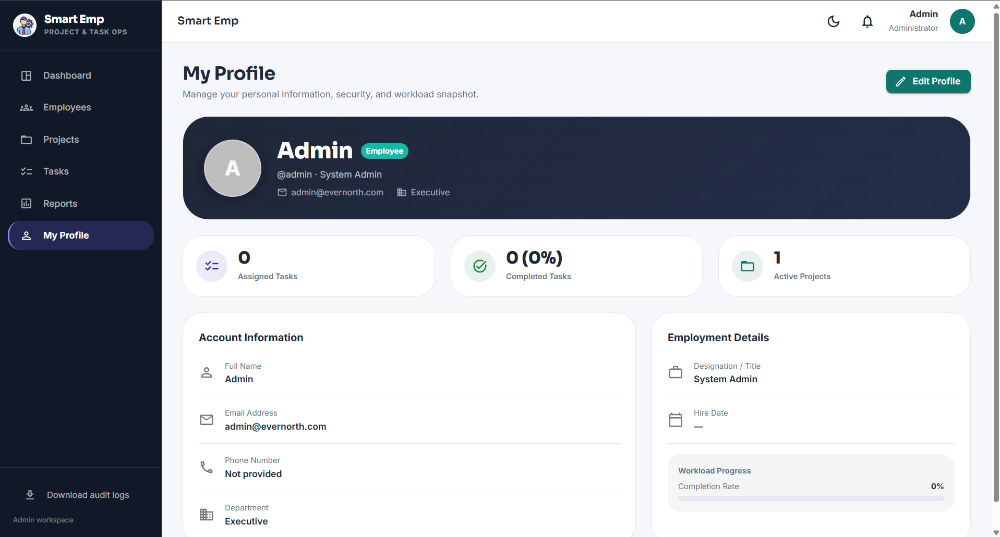
*Figure 2.8: User Profile interface with work performance metrics.*

---

### 2.3 Employee Workspace (`ROLE_EMPLOYEE`)

Dedicated dashboard for team members to track assigned tasks, monitor color-coded upcoming deadlines, update task statuses with remarks, and download personal work summaries.

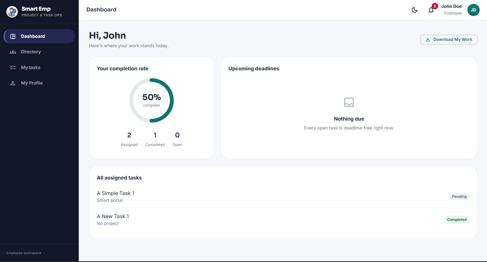
*Figure 2.9: Employee Workspace Dashboard with completion percentage ring and CSV/PDF download controls.*

---

### 2.4 Data Export & Automated Email Notifications

Enterprise data export capabilities and asynchronous event-driven email notifications.

#### 2.4.1 Formatted PDF & CSV Report Output
Generated PDF reports include branded headers, visual summary bars, auto-tables, and page numbering. CSV exports provide raw formatted data compatible with Microsoft Excel and spreadsheet software.

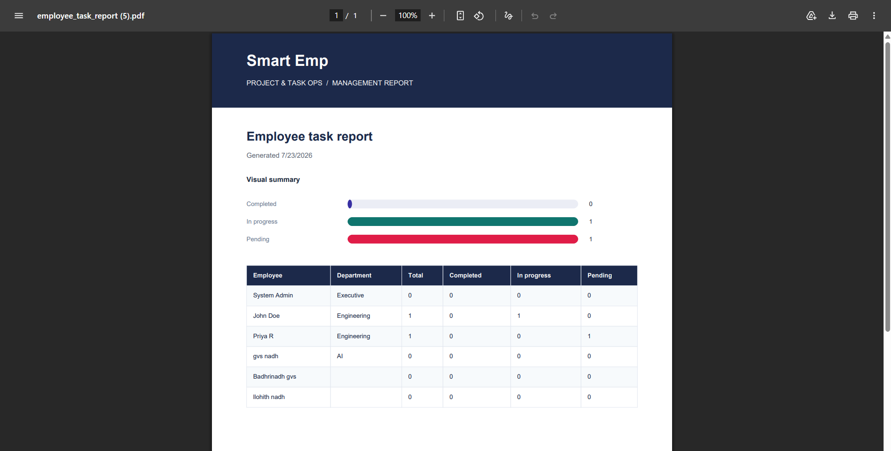
*Figure 2.10: Auto-generated PDF report sample.*

#### 2.4.2 Asynchronous HTML Email Notifications
Event-driven HTML emails dispatched asynchronously upon task assignments, status changes, account approvals, and system alerts without blocking UI operations.

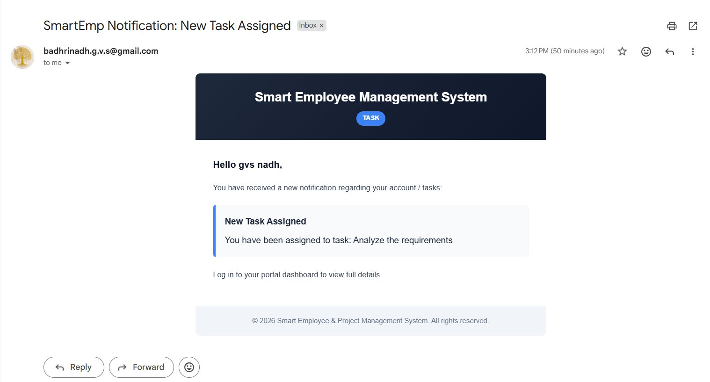
*Figure 2.11: Sample HTML email notification.*

---

## 3. System Flowcharts & Diagrams

### 3.1 High-Level Architecture Flowchart

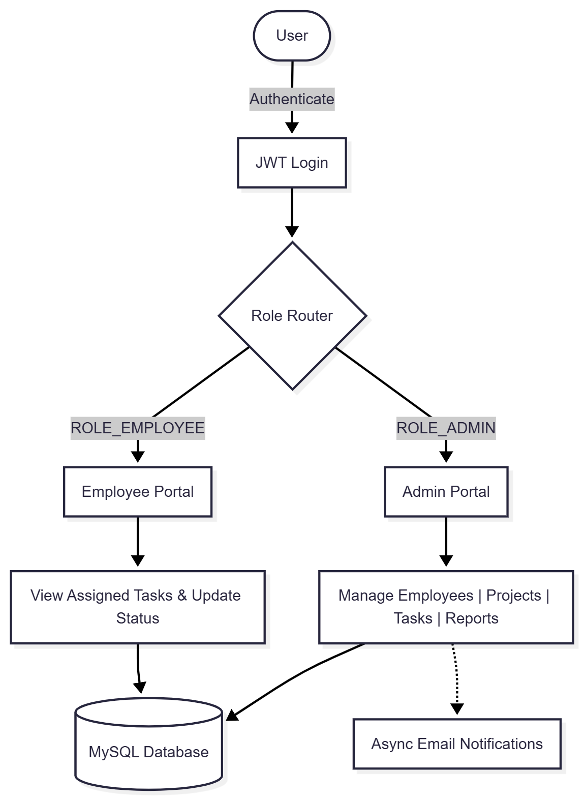
*Figure 3.1: System Architecture & Data Flowchart.*

<details>
<summary>Click to view Mermaid Source Code</summary>

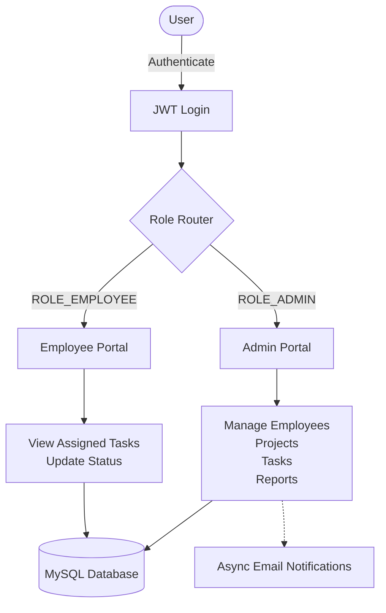
```mermaid
graph TD
    User([User]) -->|Authenticate| Auth[JWT Login]
    Auth --> Portal{Role Router}

    Portal -->|ROLE_ADMIN| Admin[Admin Portal]
    Admin --> AdminOps["Manage Employees<br/>Projects<br/>Tasks<br/>Reports"]

    Portal -->|ROLE_EMPLOYEE| Emp[Employee Portal]
    Emp --> EmpOps["View Assigned Tasks<br/>Update Status"]

    AdminOps --> DB[(MySQL Database)]
    EmpOps --> DB

    AdminOps -.-> Mail[Async Email Notifications]
```
</details>

---

### 3.2 Database Entity-Relationship (ER) Diagram

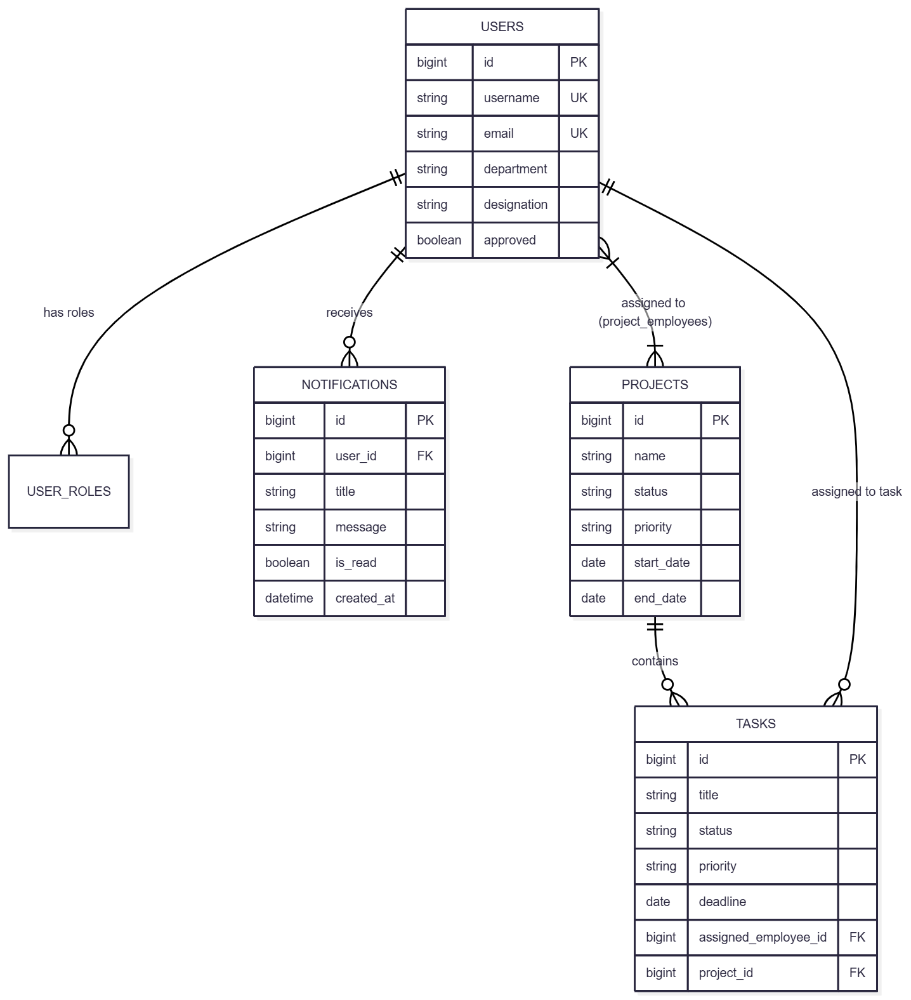
*Figure 3.2: Relational Database Entity-Relationship Diagram.*

<details>
<summary>Click to view Mermaid Source Code</summary>

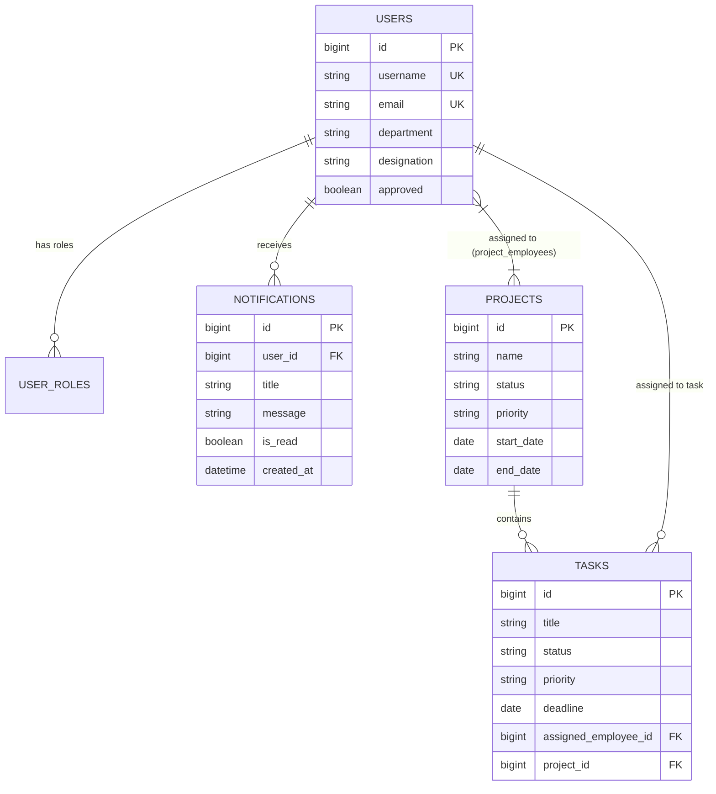
```mermaid
erDiagram
    USERS ||--o{ USER_ROLES : "has roles"
    USERS ||--o{ NOTIFICATIONS : "receives"
    USERS }|--|{ PROJECTS : "assigned to (project_employees)"
    PROJECTS ||--o{ TASKS : "contains"
    USERS ||--o{ TASKS : "assigned to task"

    USERS {
        bigint id PK
        string username UK
        string email UK
        string department
        string designation
        boolean approved
    }

    PROJECTS {
        bigint id PK
        string name
        string status
        string priority
        date start_date
        date end_date
    }

    TASKS {
        bigint id PK
        string title
        string status
        string priority
        date deadline
        bigint assigned_employee_id FK
        bigint project_id FK
    }

    NOTIFICATIONS {
        bigint id PK
        bigint user_id FK
        string title
        string message
        boolean is_read
        datetime created_at
    }
```
</details>

---

### 3.3 Authentication & Authorization Flowchart


*Figure 3.3: Authentication & Authorization Flowchart.*

<details>
<summary>Click to view Mermaid Source Code</summary>


```mermaid
graph TD
    Reg([New User]) -->|1. Submit Registration| RegForm["POST /api/auth/register"]
    RegForm -->|Save as approved=false| DB[(MySQL Database)]
    DB -.->|Notify Admin| AdminGate{Admin Approval Gate}

    AdminGate -->|PATCH /api/admin/employees/id/approve| ApproveUser[Account Approved]
    ApproveUser -->|2. Login Attempt| LoginForm["POST /api/auth/login"]

    LoginForm -->|Validate Credentials| AuthFilter{Spring Security}
    AuthFilter -->|Credentials Valid| JwtGen[Generate JWT Token]
    AuthFilter -->|Invalid or Unapproved| Deny["401 / 403 Error"]

    JwtGen -->|3. Return Token| ClientApp[React Frontend Storage]
    ClientApp -->|4. Request Protected Route| JwtCheck[JwtAuthFilter Validation]
    JwtCheck -->|Bearer Token Valid| RoleCheck{Extract User Roles}

    RoleCheck -->|ROLE_ADMIN| AdminPortal[Admin Portal /dashboard]
    RoleCheck -->|ROLE_EMPLOYEE| EmpPortal[Employee Portal /]

    ClientApp -->|5. Click Logout| Logout[Clear Local Token & Redirect to /login]
```
</details>

---

### 3.4 Employee Management Flowchart


*Figure 3.4: Employee Management Lifecycle Flowchart.*

<details>
<summary>Click to view Mermaid Source Code</summary>

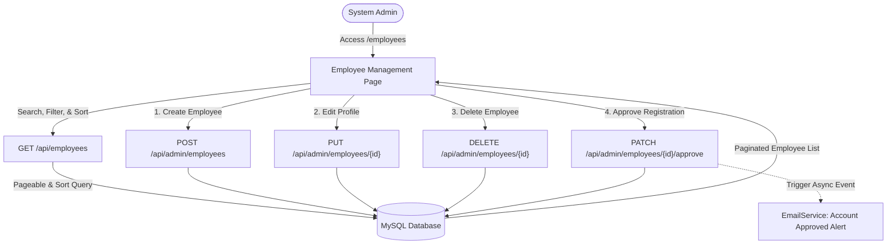
```mermaid
graph TD
    Admin([System Admin]) -->|Access /employees| EmpPage[Employee Management Page]

    EmpPage -->|Search, Filter, & Sort| ServerReq["GET /api/employees"]
    ServerReq -->|Pageable & Sort Query| DB[(MySQL Database)]
    DB -->|Paginated Employee List| EmpPage

    EmpPage -->|1. Create Employee| AddEmp["POST /api/admin/employees"]
    EmpPage -->|2. Edit Profile| EditEmp["PUT /api/admin/employees/{id}"]
    EmpPage -->|3. Delete Employee| DelEmp["DELETE /api/admin/employees/{id}"]
    EmpPage -->|4. Approve Registration| ApprEmp["PATCH /api/admin/employees/{id}/approve"]

    AddEmp --> DB
    EditEmp --> DB
    DelEmp --> DB
    ApprEmp --> DB

    ApprEmp -.->|Trigger Async Event| Mail[EmailService: Account Approved Alert]
```
</details>

---

### 3.5 Project Management Flowchart


*Figure 3.5: Project Management & Progress Calculation Flowchart.*

<details>
<summary>Click to view Mermaid Source Code</summary>

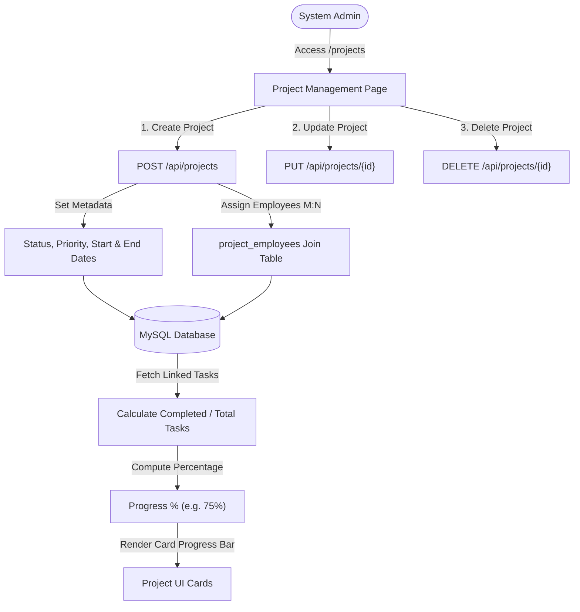
```mermaid
graph TD
    Admin([System Admin]) -->|Access /projects| ProjPage[Project Management Page]

    ProjPage -->|1. Create Project| NewProj["POST /api/projects"]
    ProjPage -->|2. Update Project| UpdateProj["PUT /api/projects/{id}"]
    ProjPage -->|3. Delete Project| DeleteProj["DELETE /api/projects/{id}"]

    NewProj -->|Assign Employees M:N| MapEmployees[project_employees Join Table]
    NewProj -->|Set Metadata| SetDetails["Status, Priority, Start & End Dates"]

    SetDetails --> DB[(MySQL Database)]
    MapEmployees --> DB

    DB -->|Fetch Linked Tasks| CalcProgress["Calculate Completed / Total Tasks"]
    CalcProgress -->|Compute Percentage| ProgressVal["Progress % (e.g. 75%)"]
    ProgressVal -->|Render Card Progress Bar| UI[Project UI Cards]
```
</details>

---

### 3.6 Task Management & Progress Feedback Flowchart


*Figure 3.6: Task Tracking & Status Transition Flowchart.*

<details>
<summary>Click to view Mermaid Source Code</summary>

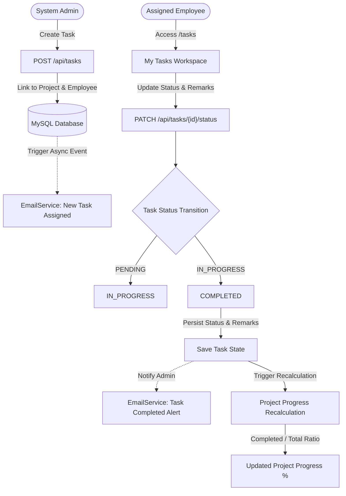
```mermaid
graph TD
    Admin([System Admin]) -->|Create Task| TaskForm["POST /api/tasks"]
    TaskForm -->|Link to Project & Employee| TaskDB[(MySQL Database)]

    TaskDB -.->|Trigger Async Event| NotifyEmp[EmailService: New Task Assigned]

    Emp([Assigned Employee]) -->|Access /tasks| MyTasks[My Tasks Workspace]
    MyTasks -->|Update Status & Remarks| StatusChange["PATCH /api/tasks/{id}/status"]

    StatusChange --> StateMachine{Task Status Transition}
    StateMachine -->|PENDING| InProgress[IN_PROGRESS]
    StateMachine -->|IN_PROGRESS| Completed[COMPLETED]

    Completed -->|Persist Status & Remarks| DBUpdate[Save Task State]
    DBUpdate -.->|Notify Admin| AdminMail[EmailService: Task Completed Alert]

    DBUpdate -->|Trigger Recalculation| ProjRecalc[Project Progress Recalculation]
    ProjRecalc -->|Completed / Total Ratio| ProjBar[Updated Project Progress %]
```
</details>

---

### 3.7 End-to-End API Request Lifecycle & Error Handling Flowchart


*Figure 3.7: API Request Execution Lifecycle & Exception Interception Flowchart.*

<details>
<summary>Click to view Mermaid Source Code</summary>

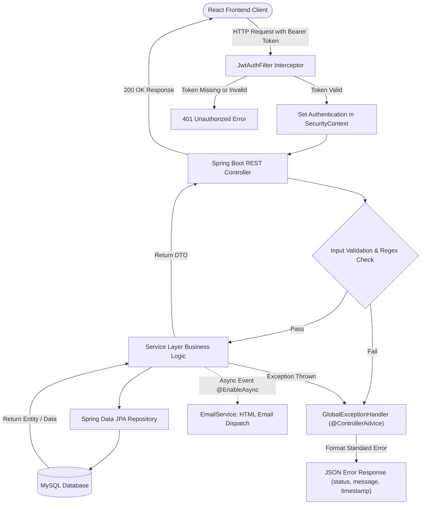
```mermaid
graph TD
    Client([React Frontend Client]) -->|HTTP Request with Bearer Token| JwtFilter[JwtAuthFilter Interceptor]

    JwtFilter -->|Token Valid| SecContext[Set Authentication in SecurityContext]
    JwtFilter -->|Token Missing or Invalid| AuthError["401 Unauthorized Error"]

    SecContext --> Controller[Spring Boot REST Controller]
    Controller --> Validation{Input Validation & Regex Check}

    Validation -->|Pass| Service[Service Layer Business Logic]
    Validation -->|Fail| ExHandler

    Service --> Repo[Spring Data JPA Repository]
    Repo --> DB[(MySQL Database)]

    Service -.->|Async Event @EnableAsync| EmailService[EmailService: HTML Email Dispatch]

    Service -->|Exception Thrown| ExHandler["GlobalExceptionHandler (@ControllerAdvice)"]
    ExHandler -->|Format Standard Error| ErrJson["JSON Error Response (status, message, timestamp)"]

    DB -->|Return Entity / Data| Service
    Service -->|Return DTO| Controller
    Controller -->|200 OK Response| Client
```
</details>

---

## 4. Features Checklist & System Capabilities

### Authentication & Authorization
- [x] **User Registration**: New employees register with personal, department, and credential details.
- [x] **Login & Logout**: JWT-based login with persistent token storage and clean session teardown.
- [x] **JWT Authentication**: Stateless authentication header (`Bearer <token>`) validated via custom filter.
- [x] **Role-Based Access Control (RBAC)**: Fine-grained permissions for `ROLE_ADMIN` and `ROLE_EMPLOYEE`.
- [x] **Admin Account Approval Gate**: Newly registered users require explicit Admin approval before access is granted.

### Client-Side Form Validation & Regex Patterns
- [x] **Pattern-Based Regex Validation**: Input forms across Registration, Login, Employee, Project, Task, and Profile management strictly enforce regex patterns (`USERNAME`, `EMAIL`, `NAME`, `PHONE`, `PASSWORD`, `SALARY`, `TITLE`, `DATE`).
- [x] **Real-Time Feedback**: Inline field errors and instant notification toasts for pattern mismatches.

### User Profile Management
- [x] **Personal Profile Dashboard**: View credentials, department, designation, hire date, and assigned task metrics.
- [x] **Profile Editing**: Edit personal details and update passwords from an interactive modal with regex checks.
- [x] **Work Performance Snapshot**: Real-time summary of assigned tasks, completion percentages, and active projects.

### Employee Management
- [x] **Employee CRUD Operations**: Complete create, read, update, delete management for System Administrators.
- [x] **Employee Search & Sorting**: Full-text search and server-side multi-field sorting (`firstName`, `lastName`, `department`, `salary`, `hireDate`).
- [x] **Server-Side Pagination**: Efficient paginated fetching for large employee databases.

### Project Management
- [x] **Project Lifecycle Management**: Full CRUD operations for tracking corporate projects.
- [x] **Employee Assignments**: Many-to-Many employee team allocation per project.
- [x] **Dynamic Completion Progress Bar**: Real-time progress percentage auto-computed from associated tasks.
- [x] **Status & Priority Indicators**: Track project statuses (`NOT_STARTED`, `IN_PROGRESS`, `COMPLETED`, `SUSPENDED`) and priorities (`LOW`, `MEDIUM`, `HIGH`).

### Task Management
- [x] **Task Creation & Allocation**: Create and assign work items to team members under specific projects.
- [x] **Status Lifecycle & Transitions**: Move tasks through `PENDING` $\rightarrow$ `IN_PROGRESS` $\rightarrow$ `COMPLETED`.
- [x] **Employee Status Updates**: Assigned employees can update task statuses (`PATCH /api/tasks/{id}/status`) and add completion remarks.

### Dashboards & Analytics
- [x] **Admin Dashboard**: Live KPI cards, task breakdown pie charts, project status bar charts, team workload charts, 7-day deadline trends, and a manual test email modal.
- [x] **Employee Dashboard**: Task statistics, assigned task tables, inline status controls, deadline countdowns, and quick export menus.

### Search & Filtering
- [x] **Global Search**: Instant multi-field search filtering across employee names, project names, and task titles.
- [x] **Department Filtering**: Filter employee listings by target department.
- [x] **Status & Priority Filtering**: Filter projects and tasks by operational status or priority level.
- [x] **Date-Based Filtering**: Filter tasks by deadline date range, projects by start/end date range, and employees by hire date range.

### Reports & Data Export (CSV / PDF Options)
- [x] **Dual Format Export**: One-click dropdown supporting **CSV** (Excel-compatible) and **PDF** report downloads across all portals.
- [x] **Employee-wise Task Report**: Detailed task breakdown and workload distribution per employee.
- [x] **Project Progress Report**: Progress percentage and task completion ratios per project.
- [x] **Pending Task Report**: Aggregated overview of open and overdue tasks across all teams.

### Advanced Capabilities & Documentation
- [x] **Swagger / OpenAPI Documentation**: Live interactive REST documentation at `/swagger-ui.html`.
- [x] **Postman Collections**: Pre-configured collection with automated JWT token capture scripts.
- [x] **Database Scripts**: Automated schema initialization and seed data DML scripts.
- [x] **Docker & Docker Compose**: Multi-container containerization setup (`docker-compose.yml`).
- [x] **Asynchronous Email Notifications**: Event-driven HTML email dispatches for task assignments, status changes, and approvals.
- [x] **Audit Logs**: Administrative activity audit logging with CSV export (`/api/admin/audit-logs/export`).

---

### 4.1 Unit & Integration Testing Suite

The project incorporates a testing architecture covering backend business logic, controller endpoints, and data access layers.

| Test Layer | Technologies / Frameworks | Coverage Scope | Execution Command |
| :--- | :--- | :--- | :--- |
| **Backend Services** | JUnit 5, Mockito | Business logic, entity mappings, validation rules, security checks | `mvn test` |
| **Backend Controllers** | Spring Boot Test, MockMvc | REST endpoints, HTTP status codes, payload serialization, RBAC gates | `mvn test` |
| **Backend Repositories** | DataJpaTest, H2 / MySQL | Custom JPA query methods, entity relationships, constraints | `mvn test` |
| **Frontend UI Component Testing** | Jest / Vitest, React Testing Library | Component rendering, state transitions, user interactions | `npm test` |

#### Running Tests

1. **Execute Backend Unit & Integration Tests**:
   ```bash
   cd backend
   mvn test
   ```

2. **Execute Frontend Component Tests**:
   ```bash
   cd frontend
   npm test
   ```

---

## 5. Database Scripts & Schema

The system includes pre-configured SQL scripts for creating the relational database schema and populating initial seed data.

- **File Location**: [database/schema_and_data.sql](database/schema_and_data.sql)

### 5.1 Initial Seed Data DML

```sql
INSERT INTO `users` (`id`, `username`, `email`, `password`, `first_name`, `last_name`, `department`, `designation`, `salary`, `phone`, `hire_date`, `approved`) VALUES
(1, 'admin', 'admin@evernorth.com', '$2a$10$8.UnVuG9HHgffUDAlk8qfOuVGkqRzgVym54n0ySg6Y.6.1J0O.YKG', 'System', 'Admin', 'Executive', 'System Admin', 1800000.0, '+1000000000', '2024-01-01', b'1'),
(2, 'john_doe', 'john.doe@evernorth.com', '$2a$10$e8w.p4eDkXg8j/2r9f3LceY8rS8zJ5O0e/5qX9y7Z.1K4.YKG', 'John', 'Doe', 'Engineering', 'Senior Developer', 950000.0, '+1000000001', '2024-02-15', b'1'),
(3, 'priya_r', 'priya.r@evernorth.com', '$2a$10$e8w.p4eDkXg8j/2r9f3LceY8rS8zJ5O0e/5qX9y7Z.1K4.YKG', 'Priya', 'R', 'Engineering', 'QA Engineer', 820000.0, '+1000000002', '2024-03-01', b'1');

INSERT INTO `user_roles` (`user_id`, `role`) VALUES
(1, 'ADMIN'), (1, 'EMPLOYEE'),
(2, 'EMPLOYEE'),
(3, 'EMPLOYEE');

INSERT INTO `projects` (`id`, `name`, `description`, `status`, `priority`, `start_date`, `end_date`) VALUES
(1, 'Smart Portal Revamp', 'Comprehensive redesign and feature expansion of corporate employee portal.', 'IN_PROGRESS', 'HIGH', '2024-06-01', '2024-12-31');

INSERT INTO `project_employees` (`project_id`, `employee_id`) VALUES
(1, 2), (1, 3);

INSERT INTO `tasks` (`id`, `title`, `description`, `status`, `priority`, `deadline`, `remarks`, `assigned_employee_id`, `project_id`) VALUES
(1, 'Implement portal features', 'Build core REST APIs and React UI components.', 'IN_PROGRESS', 'HIGH', '2024-08-15', 'Backend APIs completed, UI in progress', 2, 1),
(2, 'Test portal features', 'Execute end-to-end unit and integration test suite.', 'PENDING', 'MEDIUM', '2024-08-30', 'Awaiting feature completion', 3, 1);

INSERT INTO `notifications` (`id`, `user_id`, `title`, `message`, `is_read`, `type`, `created_at`) VALUES
(1, 1, 'Welcome Admin', 'Welcome to Smart Employee Management System!', b'0', 'SYSTEM', NOW()),
(2, 1, 'System Alert', 'New employee registration requests are pending review.', b'0', 'SYSTEM', NOW()),
(3, 2, 'Welcome John', 'Welcome to the platform. Check out your assigned tasks.', b'0', 'SYSTEM', NOW()),
(4, 2, 'Task Assigned', 'You have been assigned to task: Implement portal features', b'0', 'TASK', NOW()),
(5, 3, 'Welcome Priya', 'Welcome to the team! You have 1 new task assigned.', b'0', 'SYSTEM', NOW());
```

---

## 6. Postman Collections

A comprehensive Postman collection is provided for testing all REST API endpoints.

- **Collection File**: [postman/Smart_Employee_Management_System.postman_collection.json](postman/Smart_Employee_Management_System.postman_collection.json)

### 6.1 Quick Import & Execution Guide
1. Open **Postman** $\rightarrow$ Click **Import**.
2. Select `Smart_Employee_Management_System.postman_collection.json`.
3. Open **Authentication** folder $\rightarrow$ Run **1. Admin Login**.
4. The post-response script automatically extracts the JWT `token` and sets the `{{jwtToken}}` collection variable.
5. All subsequent requests in **Employee Management**, **Projects**, **Tasks**, **Notifications**, and **Audit Logs** attach `Authorization: Bearer {{jwtToken}}`.

---

## 7. API Overview

The backend REST API provides structured endpoints across functional domains. All endpoints (except Auth) require a valid JWT Bearer token in the request header.

### 7.1 Authentication Domain
| Method | Endpoint | Required Role | Description |
| :--- | :--- | :--- | :--- |
| `POST` | `/api/auth/register` | Public | Register a new employee account (sets account status to pending approval) |
| `POST` | `/api/auth/login` | Public | Authenticate user credentials and issue a signed JWT token |

### 7.2 Employee Management Domain
| Method | Endpoint | Required Role | Description |
| :--- | :--- | :--- | :--- |
| `GET` | `/api/employees` | `ROLE_ADMIN`, `ROLE_EMPLOYEE` | Retrieve paginated employee list with search, sorting, and hire date filtering |
| `GET` | `/api/employees/{id}` | `ROLE_ADMIN`, `ROLE_EMPLOYEE` | Fetch detailed profile data for a specific employee |
| `POST` | `/api/admin/employees` | `ROLE_ADMIN` | Create a new employee record |
| `PUT` | `/api/admin/employees/{id}` | `ROLE_ADMIN` | Update employee information, department, designation, or salary |
| `DELETE` | `/api/admin/employees/{id}` | `ROLE_ADMIN` | Remove an employee record from the database |
| `PATCH` | `/api/admin/employees/{id}/approve` | `ROLE_ADMIN` | Approve a pending user account registration |

### 7.3 Project Management Domain
| Method | Endpoint | Required Role | Description |
| :--- | :--- | :--- | :--- |
| `GET` | `/api/projects` | `ROLE_ADMIN`, `ROLE_EMPLOYEE` | Fetch all projects with calculated completion progress and assigned team members |
| `GET` | `/api/projects/{id}` | `ROLE_ADMIN`, `ROLE_EMPLOYEE` | Retrieve project metadata by ID |
| `POST` | `/api/projects` | `ROLE_ADMIN` | Create a new project and assign team members |
| `PUT` | `/api/projects/{id}` | `ROLE_ADMIN` | Update project metadata, start/end dates, status, priority, or team assignments |
| `DELETE` | `/api/projects/{id}` | `ROLE_ADMIN` | Delete a project record and disassociate linked tasks |

### 7.4 Task Management Domain
| Method | Endpoint | Required Role | Description |
| :--- | :--- | :--- | :--- |
| `GET` | `/api/tasks` | `ROLE_ADMIN` | Retrieve all tasks across all projects with status and priority filters |
| `GET` | `/api/tasks/employee/{employeeId}` | `ROLE_ADMIN`, `ROLE_EMPLOYEE` | Fetch tasks assigned to a specific employee |
| `POST` | `/api/tasks` | `ROLE_ADMIN` | Create and assign a new task under a project |
| `PUT` | `/api/tasks/{id}` | `ROLE_ADMIN` | Update task details, priority badge, or deadline date |
| `DELETE` | `/api/tasks/{id}` | `ROLE_ADMIN` | Remove a task record |
| `PATCH` | `/api/tasks/{id}/status` | `ROLE_ADMIN`, `ROLE_EMPLOYEE` | Update task progress status (`PENDING`, `IN_PROGRESS`, `COMPLETED`) and append remarks |

### 7.5 Notifications & Audit Logs Domain
| Method | Endpoint | Required Role | Description |
| :--- | :--- | :--- | :--- |
| `GET` | `/api/notifications` | Authenticated | Retrieve unread and read notifications for the current user |
| `PATCH` | `/api/notifications/{id}/read` | Authenticated | Mark a notification as read |
| `GET` | `/api/admin/audit-logs` | `ROLE_ADMIN` | Fetch paginated administrative activity audit logs |
| `GET` | `/api/admin/audit-logs/export` | `ROLE_ADMIN` | Download audit log history in CSV format |
| `POST` | `/api/admin/test-email` | `ROLE_ADMIN` | Dispatch a test HTML email alert to verify SMTP settings |

---

## 8. Project Structure

```
Smart-Employee-Project-Management-System/
├── backend/
│   ├── src/main/java/com/evernorth/smartemp/
│   │   ├── config/
│   │   │   ├── DataInitializer.java
│   │   │   └── SecurityConfig.java
│   │   ├── controller/
│   │   │   ├── AdminEmployeeController.java
│   │   │   ├── AuditLogController.java
│   │   │   ├── AuthController.java
│   │   │   ├── EmployeeController.java
│   │   │   ├── NotificationController.java
│   │   │   ├── ProjectController.java
│   │   │   ├── TaskController.java
│   │   │   └── TestEmailController.java
│   │   ├── dto/
│   │   │   ├── AuthDtos.java
│   │   │   ├── EmployeeDto.java
│   │   │   ├── NotificationDto.java
│   │   │   ├── ProjectDto.java
│   │   │   └── TaskDto.java
│   │   ├── entity/
│   │   │   ├── AuditLog.java
│   │   │   ├── Notification.java
│   │   │   ├── Project.java
│   │   │   ├── Task.java
│   │   │   └── User.java
│   │   ├── enums/
│   │   │   ├── Priority.java
│   │   │   ├── ProjectStatus.java
│   │   │   ├── Role.java
│   │   │   └── TaskStatus.java
│   │   ├── exception/
│   │   │   ├── BadRequestException.java
│   │   │   ├── GlobalExceptionHandler.java
│   │   │   └── ResourceNotFoundException.java
│   │   ├── repository/
│   │   │   ├── AuditLogRepository.java
│   │   │   ├── NotificationRepository.java
│   │   │   ├── ProjectRepository.java
│   │   │   ├── TaskRepository.java
│   │   │   └── UserRepository.java
│   │   ├── security/
│   │   │   ├── CustomUserDetailsService.java
│   │   │   ├── JwtAuthFilter.java
│   │   │   └── JwtUtil.java
│   │   ├── service/
│   │   │   ├── AuthService.java
│   │   │   ├── EmailService.java
│   │   │   ├── EmployeeService.java
│   │   │   ├── NotificationService.java
│   │   │   ├── ProjectService.java
│   │   │   └── TaskService.java
│   │   └── SmartEmpMgmtApplication.java
│   ├── src/test/java/com/evernorth/smartemp/
│   │   └── service/
│   │       └── EmployeeServiceTest.java
│   ├── src/main/resources/
│   │   ├── application.properties
│   │   └── logback-spring.xml
│   ├── Dockerfile
│   └── pom.xml
├── frontend/
│   ├── src/
│   │   ├── api/
│   │   ├── components/
│   │   ├── context/
│   │   ├── pages/
│   │   ├── routes/
│   │   ├── utils/
│   │   ├── App.jsx
│   │   ├── main.jsx
│   │   └── theme.js
│   ├── Dockerfile
│   ├── nginx.conf
│   └── package.json
├── database/
│   └── schema_and_data.sql
├── docs/
│   └── screenshots/
├── postman/
│   └── Smart_Employee_Management_System.postman_collection.json
├── docker-compose.yml
└── README.md
```

---

## 9. Prerequisites & Setup Instructions

### Option A: Docker Compose (Quickest Method)

1. **Clone the Repository**:
   ```bash
   git clone https://github.com/Badhrinadhgvs/Smart-Employee-Project-Management-System-Using-Spring-and-React.git
   cd Smart-Employee-Project-Management-System-Using-Spring-and-React
   ```

2. **Launch Containers**:
   ```bash
   docker-compose up --build
   ```

3. **Access Services**:
   - **Frontend Portal**: `http://localhost:5173`
   - **Backend REST API**: `http://localhost:8080`
   - **Swagger Documentation**: `http://localhost:8080/swagger-ui.html`

---

### Option B: Local Manual Setup

#### Step 1: Database Setup
Ensure MySQL 8.0/8.4 is running locally. Execute [database/schema_and_data.sql](database/schema_and_data.sql) or configure Hibernate auto-creation in `application.properties`:
```properties
spring.datasource.url=jdbc:mysql://localhost:3306/Employee_Management?createDatabaseIfNotExist=true&useSSL=false&serverTimezone=UTC
spring.datasource.username=root
spring.datasource.password=${SPRING_DATASOURCE_PASSWORD:root}
spring.jpa.hibernate.ddl-auto=update
```

#### Step 2: Configure Email Notifications (`application.properties`)
```properties
spring.mail.host=${SPRING_MAIL_HOST:smtp.gmail.com}
spring.mail.port=${SPRING_MAIL_PORT:587}
spring.mail.username=${SPRING_MAIL_USERNAME:your_email@gmail.com}
spring.mail.password=${SPRING_MAIL_PASSWORD:your_app_password}

spring.mail.properties.mail.smtp.auth=true
spring.mail.properties.mail.smtp.starttls.enable=true
spring.mail.properties.mail.smtp.starttls.required=true
spring.mail.properties.mail.smtp.connectiontimeout=5000
spring.mail.properties.mail.smtp.timeout=5000
spring.mail.properties.mail.smtp.writetimeout=5000

app.mail.enabled=${APP_MAIL_ENABLED:true}
app.mail.from=${APP_MAIL_FROM:your_email@gmail.com}
```

#### Step 3: Build & Start Spring Boot Backend
```bash
cd backend
mvn clean install
mvn test
.\mvnw.cmd spring-boot:run
```

#### Step 4: Start React Frontend
```bash
cd frontend
npm install
npm test
npm run dev
```

---

## 10. Demo / Sandbox Credentials

Default users auto-populated on application startup via `DataInitializer`:

| Role | Username | Password | Email | Description |
| :--- | :--- | :--- | :--- | :--- |
| **System Admin** | `admin` | `admin123` | `admin@evernorth.com` | Full Administrative Access (Dashboard, User Approvals, Projects, Tasks, Reports, Audit Logs) |
| **Senior Developer** | `john_doe` | `john123` | `john.doe@evernorth.com` | Employee Access (Dashboard, My Tasks, Task Status Updates) |
| **QA Engineer** | `priya_r` | `priya123` | `priya.r@evernorth.com` | Employee Access (Dashboard, My Tasks, Task Status Updates) |

---

## 11. Interactive API Documentation (Swagger UI)

Interactive Swagger UI documentation is available when running the backend:
- **Swagger Interface**: `http://localhost:8080/swagger-ui.html`
- **OpenAPI JSON Spec**: `http://localhost:8080/v3/api-docs`

---

## 12. Submission & Author Info

- **Project Repository**: [GitHub Repository](https://github.com/Badhrinadhgvs/Smart-Employee-Project-Management-System-Using-Spring-and-React)
- **Submission Context**: Developed for **EverNorth Technical Assessment (Round 2)**.
- **Author**: **Gundlapalli Venkata Sai Badhrinadh**
- **Date**: July 2026
- **License**: MIT License
