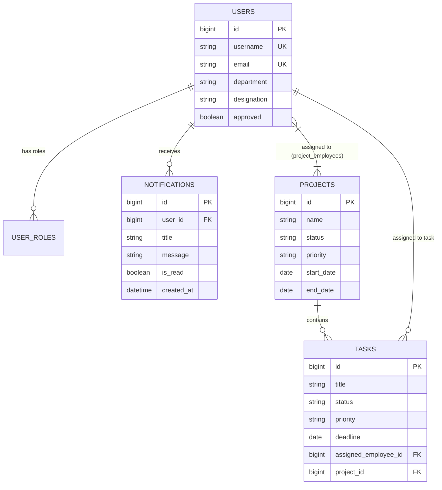
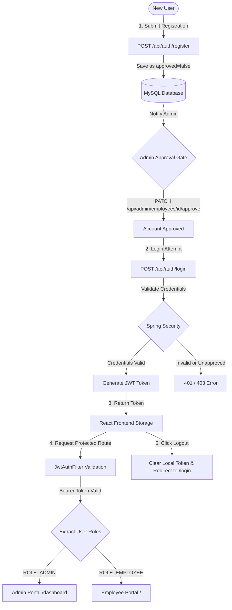

# Smart Employee & Project Management System

The **Smart Employee & Project Management System** is a full-stack enterprise web application built using **React 18** (frontend) and **Spring Boot 3.3.2** (backend) with **MySQL 8.4** database persistence. It was developed by **Gundlapalli Venkata Sai Badhrinadh** to demonstrate modern enterprise software engineering practices, role-based security, project/task tracking, real-time analytics, reporting, user profile management, database management, and asynchronous email notifications.

---

## 1. Tech Stack Overview

| Layer | Technology / Library | Description |
| :--- | :--- | :--- |
| **Frontend Framework** | React 18, Vite 5 | Single Page Application framework and build tool |
| **Frontend UI & Styling** | Material UI (MUI v5), Emotion | Design system components, dark/light theme support |
| **Data Export & Visualization**| Recharts, jsPDF, jsPDF-AutoTable, Custom CSV | Analytics charts, dual CSV & PDF report exports |
| **HTTP Client & Routing** | Axios, React Router v6 | API request handling with JWT interceptors & route protection |
| **Backend Framework** | Java 17, Spring Boot 3.3.2 | Core backend framework and REST API engine |
| **Security & Auth** | Spring Security, JJWT (0.12.6) | Stateless JWT authentication & Role-Based Access Control |
| **Persistence & ORM** | Spring Data JPA, Hibernate | Database access layer with automated schema management |
| **Database** | MySQL 8.4 / 8.0 | Relational database engine |
| **Mail & Notifications** | Spring Boot Mail, `@EnableAsync` | Asynchronous HTML email alert dispatches |
| **API Documentation** | Springdoc OpenAPI (Swagger UI v2.6.0) | Interactive API documentation |
| **Containerization** | Docker, Docker Compose | Multi-container environment (MySQL, Spring Backend, Nginx Frontend) |
| **Build & Package** | Maven 3.8+, npm | Dependency management and build tools |

---

## 2. Features Checklist

### Authentication & Authorization
- [x] **User Registration**: New employees can register with personal, department, and credential details.
- [x] **Login & Logout**: JWT-based login with persistent token handling and clean session logout.
- [x] **JWT Authentication**: Stateless authentication header (`Bearer <token>`) validated via custom filter.
- [x] **Role-Based Access Control (RBAC)**: Fine-grained permissions for `ROLE_ADMIN` and `ROLE_EMPLOYEE`.
- [x] **Admin Account Approval**: Newly registered users require explicit Admin approval before gaining full access.

### Client-Side Form Validation & Regex Patterns
- [x] **Pattern-Based Regex Validation**: Input fields across Registration, Login, Employee Creation/Edit, Project Creation/Edit, Task Assignment, and Profile Edit forms strictly enforce regular expressions (`USERNAME`, `EMAIL`, `NAME`, `PHONE`, `PASSWORD`, `SALARY`, `TITLE`, `DATE`).
- [x] **Real-Time User Feedback**: Instant, clear notification toasts and inline errors for pattern mismatches.

### User Profile Management
- [x] **Personal Profile Dashboard**: View account details, department, designation, and hire date.
- [x] **Profile Editing**: Edit personal details (First Name, Last Name, Phone, Department) and update password directly from the user profile modal with regex pattern checks.
- [x] **Personal Work Stats**: Real-time snapshot of assigned tasks, completed tasks, completion percentage, and active projects.

### Employee Management
- [x] **Add / Update / Delete / View Employees**: Full CRUD operations managed by Admin.
- [x] **Employee Search**: Full-text search across employee names, email addresses, and designations.
- [x] **Pagination & Sorting**: Server-side pagination and field sorting (`firstName`, `lastName`, `department`, `salary`, `hireDate`).

### Project Management
- [x] **Create / Update / Delete Projects**: Comprehensive project lifecycle management.
- [x] **Employee Assignment**: Many-to-Many assignment connecting multiple employees to projects.
- [x] **Dynamic Task Completion Progress Bar**: Interactive linear progress bar on project cards calculated in real-time based on completed tasks.
- [x] **Status, Priority & Deadlines**: Manage project status (`NOT_STARTED`, `IN_PROGRESS`, `COMPLETED`, `SUSPENDED`) and priority (`LOW`, `MEDIUM`, `HIGH`).
- [x] **Project Export**: Export project summaries and progress breakdowns in CSV or PDF.

### Task Management
- [x] **Create & Assign Tasks**: Assign specific tasks to employees under active projects.
- [x] **Task Status & Progress Tracking**: Statuses include `PENDING`, `IN_PROGRESS`, `COMPLETED`.
- [x] **Task Status Updates**: Employees can update task statuses (`PATCH /api/tasks/{id}/status`).
- [x] **Remarks & Notes**: Add optional notes/remarks to tasks.
- [x] **Task Export**: Export task lists with project associations in CSV or PDF.

### Dashboards & Analytics
- [x] **Admin Dashboard**: Live KPI cards, task breakdown pie charts, project status bar charts, team workload charts, 7-day deadline trends, and a manual Test Email alert modal.
- [x] **Employee Dashboard**: Workload statistics, personal assigned task list, status toggles, upcoming deadline countdowns, and direct **CSV / PDF download options** for employee task data.

### Search & Filtering
- [x] **Search**: Instant search filtering across employees, projects, and task titles.
- [x] **Filter by Department**: Filter employee listings by department name.
- [x] **Filter by Status & Priority**: Filter projects and tasks by status or priority levels.

### Reports & Data Export (CSV / PDF Options)
- [x] **Employee Project & Task Downloads**: Employees can export their assigned tasks and project details from their Dashboard and Tasks views.
- [x] **Dual Format Download Options**: One-click dropdown supporting both **CSV** and **PDF** downloads across Dashboards, Projects, Tasks, and Reports.
- [x] **Employee-wise Task Report**: Detailed task distribution table per employee.
- [x] **Project Progress Report**: Progress percentage and task breakdown per project.
- [x] **Pending Task Report**: Summary of open and overdue tasks across teams.

### Advanced Capabilities & Documentation
- [x] **Swagger / OpenAPI Documentation**: Live interactive REST docs at `/swagger-ui.html`.
- [x] **Postman Collections**: Ready-to-use API collection with automatic JWT token capture scripts.
- [x] **Database Scripts**: Included production DDL schema and DML seed scripts.
- [x] **Mermaid System Flowchart**: Built-in clean, minimalistic architecture flow diagram.
- [x] **Docker & Docker Compose**: Full multi-container orchestration (`docker-compose.yml`).
- [x] **Email Notifications**: Asynchronous HTML email notifications for task assignment, status updates, and account approval.
- [x] **Audit Logs**: Administrative CSV audit log export (`/api/admin/audit-logs`).

---

## 3. System Flowcharts & Diagrams

### 3.1 High-Level Architecture Flowchart

*Figure 3.1: High-level System Architecture & Execution Flowchart.*

<details>
<summary>Click to view Mermaid Source Code</summary>


</details>

---

### 3.2 Database Entity-Relationship (ER) Diagram

*Figure 3.2: Relational Database Schema & Entity Relationships.*

<details>
<summary>Click to view Mermaid Source Code</summary>


</details>

---

### 3.3 Authentication & Authorization Flowchart
*Figure 3.3: Authentication, Admin Approval Gate, JWT Issuance, Token Validation, & Role Routing Flow.*

<details>
<summary>Click to view Mermaid Source Code</summary>


</details>

---

### 3.4 Employee Management Flowchart
*Figure 3.4: Administrative Employee CRUD Lifecycle, Search, Server Pagination, & Approval Sub-Flow.*

<details>
<summary>Click to view Mermaid Source Code</summary>


</details>

---

### 3.5 Project Management Flowchart
*Figure 3.5: Project Lifecycle, Many-to-Many Employee Assignment, & Task Progress Calculation Flow.*

<details>
<summary>Click to view Mermaid Source Code</summary>


</details>

---

### 3.6 Task Management & Progress Feedback Flowchart
*Figure 3.6: Task Creation, Employee Assignment, Status Transitions, & Feedback Loop into Project Progress.*

<details>
<summary>Click to view Mermaid Source Code</summary>


</details>

---

### 3.7 End-to-End API Request Lifecycle & Error Handling Flowchart
*Figure 3.7: Generic REST API Request Execution Lifecycle, Exception Interception, & Async Email Dispatch.*

<details>
<summary>Click to view Mermaid Source Code</summary>


</details>

---

## 4. Database Scripts & Schema

The system includes pre-configured SQL scripts for creating the database schema and inserting initial seed data.

- **File Location**: [database/schema_and_data.sql](database/schema_and_data.sql)

### 4.1 Initial Seed Data DML
```sql
INSERT INTO `users` (`id`, `username`, `email`, `password`, `first_name`, `last_name`, `department`, `designation`, `salary`, `phone`, `hire_date`, `approved`) VALUES
(1, 'admin', 'admin@evernorth.com', '$2a$10$8.UnVuG9HHgffUDAlk8qfOuVGkqRzgVym54n0ySg6Y.6.1J0O.YKG', 'System', 'Admin', 'Executive', 'System Admin', 1800000.0, '+1000000000', '2024-01-01', b'1'),
(2, 'john_doe', 'john.doe@evernorth.com', '$2a$10$e8w.p4eDkXg8j/2r9f3LceY8rS8zJ5O0e/5qX9y7Z.1K4.YKG', 'John', 'Doe', 'Engineering', 'Senior Developer', 950000.0, '+1000000001', '2024-02-15', b'1'),
(3, 'priya_r', 'priya.r@evernorth.com', '$2a$10$e8w.p4eDkXg8j/2r9f3LceY8rS8zJ5O0e/5qX9y7Z.1K4.YKG', 'Priya', 'R', 'Engineering', 'QA Engineer', 820000.0, '+1000000002', '2024-03-01', b'1');

INSERT INTO `user_roles` (`user_id`, `role`) VALUES
(1, 'ADMIN'), (1, 'EMPLOYEE'),
(2, 'EMPLOYEE'),
(3, 'EMPLOYEE');

INSERT INTO `projects` (`id`, `name`, `description`, `status`, `priority`, `start_date`, `end_date`) VALUES
(1, 'Smart Portal Revamp', 'Comprehensive redesign and feature expansion of corporate employee portal.', 'IN_PROGRESS', 'HIGH', '2024-06-01', '2024-12-31');

INSERT INTO `project_employees` (`project_id`, `employee_id`) VALUES
(1, 2), (1, 3);

INSERT INTO `tasks` (`id`, `title`, `description`, `status`, `priority`, `deadline`, `remarks`, `assigned_employee_id`, `project_id`) VALUES
(1, 'Implement portal features', 'Build core REST APIs and React UI components.', 'IN_PROGRESS', 'HIGH', '2024-08-15', 'Backend APIs completed, UI in progress', 2, 1),
(2, 'Test portal features', 'Execute end-to-end unit and integration test suite.', 'PENDING', 'MEDIUM', '2024-08-30', 'Awaiting feature completion', 3, 1);

INSERT INTO `notifications` (`id`, `user_id`, `title`, `message`, `is_read`, `type`, `created_at`) VALUES
(1, 1, 'Welcome Admin', 'Welcome to Smart Employee Management System!', b'0', 'SYSTEM', NOW()),
(2, 1, 'System Alert', 'New employee registration requests are pending review.', b'0', 'SYSTEM', NOW()),
(3, 2, 'Welcome John', 'Welcome to the platform. Check out your assigned tasks.', b'0', 'SYSTEM', NOW()),
(4, 2, 'Task Assigned', 'You have been assigned to task: Implement portal features', b'0', 'TASK', NOW()),
(5, 3, 'Welcome Priya', 'Welcome to the team! You have 1 new task assigned.', b'0', 'SYSTEM', NOW());
```

---

## 5. Postman Collections

A comprehensive Postman Collection is included for importing and testing all REST API endpoints.

- **Collection File**: [postman/Smart_Employee_Management_System.postman_collection.json](postman/Smart_Employee_Management_System.postman_collection.json)

### 5.1 Quick Import & Execution Guide
1. Open **Postman** $\rightarrow$ Click **Import**.
2. Drag and drop `Smart_Employee_Management_System.postman_collection.json`.
3. Expand **Authentication** folder $\rightarrow$ Run **1. Admin Login**.
4. The test script in the collection automatically extracts the `token` from response JSON and sets the `{{jwtToken}}` collection variable.
5. All subsequent requests in **Employee Management**, **Projects**, **Tasks**, **Notifications**, and **Audit Logs** will automatically attach `Authorization: Bearer {{jwtToken}}`.

### 5.2 Summary of API Endpoints

| Category | Endpoint | Method | Role | Description |
| :--- | :--- | :--- | :--- | :--- |
| **Auth** | `/api/auth/login` | `POST` | Public | Authenticates user & returns JWT token |
| **Auth** | `/api/auth/register` | `POST` | Public | Registers new employee account |
| **Profile** | `/api/employees/me` | `GET` | Admin / Employee | View logged-in user profile & work stats |
| **Profile** | `/api/employees/me` | `PUT` | Admin / Employee | Update logged-in user profile & password |
| **Employees** | `/api/employees` | `GET` | Admin / Employee | Paginated employee list with search & filters |
| **Employees** | `/api/employees/list` | `GET` | Admin | Complete list of employees (for dropdowns) |
| **Admin** | `/api/admin/employees/{id}/approve` | `PATCH` | Admin | Approve pending employee registration |
| **Admin** | `/api/admin/employees` | `POST` | Admin | Create new employee |
| **Admin** | `/api/admin/employees/{id}` | `PUT` | Admin | Update existing employee profile |
| **Admin** | `/api/admin/employees/{id}` | `DELETE` | Admin | Delete employee record |
| **Admin** | `/api/admin/audit-logs` | `GET` | Admin | Export system audit logs as CSV file |
| **Admin** | `/api/admin/test-email` | `POST` | Admin | Trigger manual test email alert |
| **Projects** | `/api/projects` | `GET` | Admin / Employee | List all projects |
| **Projects** | `/api/projects/{id}` | `GET` | Admin / Employee | Get project details with task breakdown |
| **Projects** | `/api/projects` | `POST` | Admin | Create new project with team assignments |
| **Projects** | `/api/projects/{id}` | `PUT` | Admin | Update project information & status |
| **Projects** | `/api/projects/{id}` | `DELETE` | Admin | Delete project |
| **Tasks** | `/api/tasks` | `GET` | Admin / Employee | List tasks (filtered by project/user) |
| **Tasks** | `/api/tasks/my-tasks` | `GET` | Employee | View assigned tasks for logged-in employee |
| **Tasks** | `/api/tasks` | `POST` | Admin | Create task under project & assign to user |
| **Tasks** | `/api/tasks/{id}` | `PUT` | Admin | Update task details |
| **Tasks** | `/api/tasks/{id}/status` | `PATCH` | Employee | Update task progress status & remarks |
| **Tasks** | `/api/tasks/{id}` | `DELETE` | Admin | Delete task |
| **Notifications**| `/api/notifications` | `GET` | User | Get user notifications |
| **Notifications**| `/api/notifications/{id}/read` | `PATCH` | User | Mark notification as read |

---

## 6. Project Structure

```
Smart-Employee-Project-Management-System/
├── backend/
│   ├── src/main/java/com/evernorth/smartemp/
│   │   ├── config/
│   │   │   ├── DataInitializer.java
│   │   │   └── SecurityConfig.java
│   │   ├── controller/
│   │   │   ├── AdminEmployeeController.java
│   │   │   ├── AuditLogController.java
│   │   │   ├── AuthController.java
│   │   │   ├── EmployeeController.java
│   │   │   ├── NotificationController.java
│   │   │   ├── ProjectController.java
│   │   │   ├── TaskController.java
│   │   │   └── TestEmailController.java
│   │   ├── dto/
│   │   │   ├── AuthDtos.java
│   │   │   ├── EmployeeDto.java
│   │   │   ├── NotificationDto.java
│   │   │   ├── ProjectDto.java
│   │   │   └── TaskDto.java
│   │   ├── entity/
│   │   │   ├── AuditLog.java
│   │   │   ├── Notification.java
│   │   │   ├── Project.java
│   │   │   ├── Task.java
│   │   │   └── User.java
│   │   ├── enums/
│   │   │   ├── Priority.java
│   │   │   ├── ProjectStatus.java
│   │   │   ├── Role.java
│   │   │   └── TaskStatus.java
│   │   ├── exception/
│   │   │   ├── BadRequestException.java
│   │   │   ├── GlobalExceptionHandler.java
│   │   │   └── ResourceNotFoundException.java
│   │   ├── repository/
│   │   │   ├── AuditLogRepository.java
│   │   │   ├── NotificationRepository.java
│   │   │   ├── ProjectRepository.java
│   │   │   ├── TaskRepository.java
│   │   │   └── UserRepository.java
│   │   ├── security/
│   │   │   ├── CustomUserDetailsService.java
│   │   │   ├── JwtAuthFilter.java
│   │   │   └── JwtUtil.java
│   │   ├── service/
│   │   │   ├── AuthService.java
│   │   │   ├── EmailService.java
│   │   │   ├── EmployeeService.java
│   │   │   ├── NotificationService.java
│   │   │   ├── ProjectService.java
│   │   │   └── TaskService.java
│   │   └── SmartEmpMgmtApplication.java
│   ├── src/main/resources/
│   │   ├── application.properties
│   │   └── logback-spring.xml
│   ├── src/test/java/com/evernorth/smartemp/service/
│   │   └── EmployeeServiceTest.java
│   ├── Dockerfile
│   └── pom.xml
├── frontend/
│   ├── src/
│   │   ├── api/
│   │   ├── components/
│   │   ├── context/
│   │   ├── pages/
│   │   ├── routes/
│   │   ├── App.jsx
│   │   ├── main.jsx
│   │   └── theme.js
│   ├── Dockerfile
│   ├── nginx.conf
│   └── package.json
├── database/
│   └── schema_and_data.sql
├── docs/
│   └── screenshots/
├── postman/
│   └── Smart_Employee_Management_System.postman_collection.json
├── docker-compose.yml
└── README.md
```

---

## 7. Prerequisites & Setup Instructions

### Option A: Docker Compose (Quickest Method)

1. **Clone the Repository**:
   ```bash
   git clone https://github.com/Badhrinadhgvs/Smart-Employee-Project-Management-System-Using-Spring-and-React.git
   cd Smart-Employee-Project-Management-System-Using-Spring-and-React
   ```

2. **Launch Containers**:
   ```bash
   docker-compose up --build
   ```
   *(Make sure Docker / Docker Desktop is running in the background)*

3. **Access Services**:
   - Frontend Portal: `http://localhost:5173`
   - Backend REST API: `http://localhost:8080`
   - Swagger Documentation: `http://localhost:8080/swagger-ui.html`

---

### Option B: Local Manual Setup

#### Step 1: Database Setup
Ensure MySQL 8.0/8.4 is running locally. You can execute [database/schema_and_data.sql](database/schema_and_data.sql) or let Spring Boot Hibernate auto-create tables:
```properties
# backend/src/main/resources/application.properties
spring.datasource.url=jdbc:mysql://localhost:3306/Employee_Management?createDatabaseIfNotExist=true&useSSL=false&serverTimezone=UTC
spring.datasource.username=root
spring.datasource.password=${SPRING_DATASOURCE_PASSWORD:your_mysql_password}
spring.jpa.hibernate.ddl-auto=update
```

#### Step 2: Configure Email Notifications (`application.properties`)
Configure the Spring Mail properties and email dispatch settings in `backend/src/main/resources/application.properties` (or set environment variables):

```properties
# Mail & Email Notification Configuration
spring.mail.host=${SPRING_MAIL_HOST:smtp.gmail.com}
spring.mail.port=${SPRING_MAIL_PORT:587}
spring.mail.username=${SPRING_MAIL_USERNAME:your_email@gmail.com}
spring.mail.password=${SPRING_MAIL_PASSWORD:your_app_password}

# SMTP Connection & Security Settings
spring.mail.properties.mail.smtp.auth=true
spring.mail.properties.mail.smtp.starttls.enable=true
spring.mail.properties.mail.smtp.starttls.required=true
spring.mail.properties.mail.smtp.connectiontimeout=5000
spring.mail.properties.mail.smtp.timeout=5000
spring.mail.properties.mail.smtp.writetimeout=5000

# Custom Application Email Dispatch Settings
app.mail.enabled=${APP_MAIL_ENABLED:true}
app.mail.from=${APP_MAIL_FROM:your_email@gmail.com}
```

##### Email Configuration Properties Reference:

| Property | Environment Variable | Default Value | Description |
| :--- | :--- | :--- | :--- |
| `spring.mail.host` | `SPRING_MAIL_HOST` | `smtp.gmail.com` | Host server for outgoing SMTP emails |
| `spring.mail.port` | `SPRING_MAIL_PORT` | `587` | Server port (`587` for STARTTLS / `465` for SSL) |
| `spring.mail.username` | `SPRING_MAIL_USERNAME` | `badhrinadh.g.v.s@gmail.com` | Email address/username used for SMTP authentication |
| `spring.mail.password` | `SPRING_MAIL_PASSWORD` | *(App Password)* | SMTP account password or 16-digit Google App Password |
| `app.mail.enabled` | `APP_MAIL_ENABLED` | `true` | Toggle flag (`true`/`false`) to enable or disable email notifications |
| `app.mail.from` | `APP_MAIL_FROM` | `badhrinadh.g.v.s@gmail.com` | Address displayed in the `From:` header of outgoing emails |

> [!TIP]
> If using Gmail SMTP, generate an **App Password** from your Google Account settings (Security > 2-Step Verification > App Passwords) and use it as `spring.mail.password`.

#### Step 3: Start Spring Boot Backend
```bash
cd backend
mvnw clean compile
mvn clean install
.\mvnw.cmd spring-boot:run
```

#### Step 4: Start React Frontend
```bash
cd frontend
npm install
npm run dev
```

---

## 8. Demo / Sandbox Credentials

Default users automatically created on startup via `DataInitializer`:

| Role | Username | Password | Email | Description |
| :--- | :--- | :--- | :--- | :--- |
| **System Admin** | `admin` | `admin123` | `admin@evernorth.com` | Full Administrative Access (Dashboard, User Approvals, Projects, Tasks, PDF Reports, Audit Logs) |
| **Senior Developer** | `john_doe` | `john123` | `john.doe@evernorth.com` | Employee Access (Dashboard, My Tasks, Task Status Update) |
| **QA Engineer** | `priya_r` | `priya123` | `priya.r@evernorth.com` | Employee Access (Dashboard, My Tasks, Task Status Update) |

---

## 9. Interactive API Documentation (Swagger UI)

Interactive Swagger UI documentation is available when running the backend:
- **Swagger Interface**: `http://localhost:8080/swagger-ui.html`
- **OpenAPI JSON Spec**: `http://localhost:8080/v3/api-docs`

---

## 10. Application Screenshots

### 10.1 Authentication & User Access

*Figure 10.1: JWT Authentication & User Login Portal*


*Figure 10.2: Account Registration Portal*

---

### 10.2 System Admin Portal & Management Interfaces

*Figure 10.3: System Admin Dashboard with KPI Metrics, Analytics Charts, & Test Email Action*


*Figure 10.4: Employee Management Interface with Pagination, Sorting, Search, & Approvals*


*Figure 10.5: Project Lifecycle Management with Dynamic Task Progress & Team Assignment*


*Figure 10.6: Task Tracking, Status Updates, & Filtering Interface*


*Figure 10.7: Aggregated Operational Reports with Dual CSV & PDF Export Options*


*Figure 10.8: Personal Profile Management & Employment Details Dashboard*

---

### 10.3 Employee Workspace

*Figure 10.9: Employee Workload Dashboard, Completion Progress Ring, Task List, & Download Action*

---

### 10.4 Data Export & Email Notifications

*Figure 10.10: Auto-Generated Formatted PDF Report Output*


*Figure 10.11: Automated Asynchronous HTML Email Alert Dispatch*

---

## 11. Submission & Author Info

- **Project Repository**: [GitHub Repository](https://github.com/Badhrinadhgvs/Smart-Employee-Project-Management-System-Using-Spring-and-React)
- **Submission Context**: Developed for **EverNorth Technical Assessment (Round 2)**.
- **Author**: **Gundlapalli Venkata Sai Badhrinadh**
- **Date**: July 2026
- **License**: MIT License

